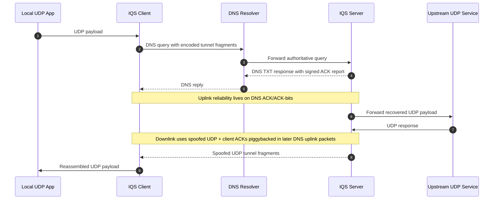

# IQS-Tunnel

IQS-Tunnel is an improved Go rewrite of QS-Tunnel. It keeps the same asymmetric transport idea:

- uplink travels inside DNS query names
- downlink returns over spoofed UDP packets

The difference is that IQS-Tunnel adds a reliability layer around that transport instead of sending blindly.

Original QS-Tunnel repository:

https://github.com/patterniha/QS-Tunnel

## Research Notice

This project is a research prototype for studying DNS-based uplink transport, spoofed UDP downlink behavior, and reliability techniques around asymmetric tunnels. It is not presented as a production-ready censorship circumvention product.

## Warning

> [!WARNING]
> IP spoofing can be disruptive, may violate provider policies, and can be illegal or unauthorized on many networks. Use IQS-Tunnel only in environments you own or are explicitly authorized to test, and only for controlled research, lab work, or defensive experimentation.

## What Changed

- DNS responses now carry a signed ACK report, so the client knows which uplink packets really reached the server.
- Every tunnel packet includes `session_id`, `seq`, `ack`, and `ack_bits`.
- The client acknowledges spoofed downlink packets in later DNS uplink packets, so the server can retransmit only what is still missing.
- DNS retries are cache-busted with per-send fragment nonces.
- The client keeps basic performance scores for resolvers and prefers healthier ones.
- Optional single-parity shard protection is available on the spoofed downlink path.

## On Overhead and Trade-Offs

One fair criticism of this design is that it adds more control metadata than the original QS-Tunnel approach. That criticism is true in spirit: IQS-Tunnel deliberately spends extra bytes on sequencing, acknowledgements, session tracking, cache-busting, and packet authentication.

The reason is simple: the original idea is lightweight, but also much more dependent on luck. Once DNS queries are dropped, reordered, cached, duplicated, or partially lost, a tunnel without feedback becomes hard to reason about and hard to recover. IQS-Tunnel chooses to pay additional overhead in exchange for better visibility into what arrived, what was lost, and what should be retransmitted.

In other words, this project does not try to be the smallest possible wrapper around QS-Tunnel. It tries to be a more observable, debuggable, and recoverable research transport, even if that means extra header cost and lower raw efficiency.

## Layout

- `cmd/iqs-client`: local client binary
- `cmd/iqs-server`: authoritative DNS + spoof server binary
- `internal/protocol`: wire format, ACK logic, fragmentation, parity
- `internal/dnsmsg`: minimal DNS TXT query/response codec
- `internal/rawip`: raw IPv4 UDP sender used for spoofed downlink

## Important Notes

- The server must be authoritative for the configured domains.
- The server needs permission to open a raw IPv4 socket in order to send spoofed UDP.
- The client still needs to transmit uplink traffic. Spoofing is only for the return path.
- This layer is still a UDP forwarder. A reliable encrypted UDP protocol such as Hysteria, WireGuard, or a QUIC-based transport should sit above it.
- The release binaries are intended for research and controlled testing. You are responsible for legal, policy, and operational compliance when using them.

## Releases

The repository includes a GitHub Actions workflow that cross-builds release archives for:

- Linux
- macOS
- FreeBSD

When a tag like `v0.1.0` is pushed, the workflow attaches archives and a `SHA256SUMS.txt` file to the GitHub release page.

## High-Level Flow



## Run

Build the binaries:

```bash
go build -o bin/iqs-server ./cmd/iqs-server
go build -o bin/iqs-client ./cmd/iqs-client
```

Then run them:

```bash
./bin/iqs-server -config configs/server.example.json
./bin/iqs-client -config configs/client.example.json
```

If you downloaded a release archive from the GitHub Releases page, use the included `iqs-server` and `iqs-client` binaries directly instead of building locally.

You can also print the embedded build version:

```bash
./bin/iqs-server -version
./bin/iqs-client -version
```

## Protocol Summary

1. The local app sends UDP to the client bind address.
2. The client wraps the datagram in a signed tunnel packet and splits it into DNS-safe fragments.
3. Recursive resolvers forward the query to the authoritative server.
4. The authoritative server reassembles the packet, forwards the UDP payload upstream, and returns a TXT ACK report in the DNS response.
5. Upstream responses are wrapped in signed downlink packets, fragmented if needed, and sent back as spoofed UDP.
6. The client reassembles them, forwards the payload locally, and piggybacks downlink ACK state on later DNS uplink packets.

## Support The Project

If this project helps people connect to the internet, please consider donating to keep it alive and support further work.

BEP-20 USDT (BNB Chain):

`0x2455B82cEAD31ceC026ae930B932a22Bb994FB76`
