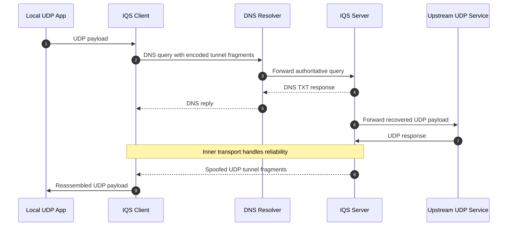

# IQS-Tunnel

IQS-Tunnel is a lighter Go rewrite of QS-Tunnel. It keeps the same asymmetric transport idea:

- uplink travels inside DNS query names
- downlink returns over spoofed UDP packets

The difference is that this revision keeps the tunnel layer intentionally small. It does not try to do in-tunnel ARQ, ACK tracking, or retransmission for already-reliable inner transports.

Original QS-Tunnel repository:

https://github.com/patterniha/QS-Tunnel

## Research Notice

This project is a research prototype for studying DNS-based uplink transport, spoofed UDP downlink behavior, and lightweight framing around asymmetric tunnels. It is not presented as a production-ready censorship circumvention product.

## Warning

> [!WARNING]
> IP spoofing can be disruptive, may violate provider policies, and can be illegal or unauthorized on many networks. Use IQS-Tunnel only in environments you own or are explicitly authorized to test, and only for controlled research, lab work, or defensive experimentation.

## What Changed

- The project is a native Go rewrite of the original Python idea.
- The tunnel keeps `session_id` so multi-client state stays separated.
- Packets are still authenticated with a shared secret, so garbage or tampered tunnel packets are rejected.
- DNS fragments still use per-send nonces to avoid accidental cache collisions.
- The client keeps basic performance scores for resolvers and prefers healthier ones.
- NAT keepalives and periodic client info refresh remain in place for the spoofed return path.

## Why This Revision Is Lighter

Earlier IQS experiments added in-tunnel sequencing, ACK reports, retransmission state, ACK-only DNS packets, and parity shards. That made the tunnel easier to observe, but it also duplicated work that is already done by inner reliable transports such as KCP, QUIC streams, or TCP-like layers.

This branch removes that extra ARQ-style machinery and keeps only what is still useful at the tunnel edge itself:

- session separation
- fragment IDs for reassembly and duplicate suppression
- nonce-based DNS cache busting
- authenticated tunnel packets
- NAT maintenance for spoofed downlink

In other words, IQS-Tunnel is no longer trying to be a mini transport protocol inside the tunnel. If you want reliability, recovery, congestion handling, or ordering, keep that in the protocol you run through the tunnel.

## Layout

- `cmd/iqs-client`: local client binary
- `cmd/iqs-server`: authoritative DNS + spoof server binary
- `internal/protocol`: wire format, fragmentation, session tagging, nonce handling
- `internal/dnsmsg`: minimal DNS TXT query/response codec
- `internal/rawip`: raw IPv4 UDP sender used for spoofed downlink

## Important Notes

- The server must be authoritative for the configured domains.
- The server needs permission to open a raw IPv4 socket in order to send spoofed UDP.
- The client still needs to transmit uplink traffic. Spoofing is only for the return path.
- IQS-Tunnel itself is not a reliable transport. If you need recovery and ordering, keep that in the inner transport you run through the tunnel.
- The release binaries are intended for research and controlled testing. You are responsible for legal, policy, and operational compliance when using them.

## Releases

The repository includes a GitHub Actions workflow that cross-builds release archives for:

- Linux
- macOS
- FreeBSD

When a tag like `v0.1.0` is pushed, the workflow attaches archives and a `SHA256SUMS.txt` file to the GitHub release page.

## High-Level Flow



## Run

Build the binaries:

```bash
go build -o bin/iqs-server ./cmd/iqs-server
go build -o bin/iqs-client ./cmd/iqs-client
```

Then run them:

```bash
./bin/iqs-server -config configs/server.example.json
./bin/iqs-client -config configs/client.example.json
```

If you downloaded a release archive from the GitHub Releases page, use the included `iqs-server` and `iqs-client` binaries directly instead of building locally.

You can also print the embedded build version:

```bash
./bin/iqs-server -version
./bin/iqs-client -version
```

## Protocol Summary

1. The local app sends UDP to the client bind address.
2. The client wraps the datagram in an authenticated tunnel packet and splits it into DNS-safe fragments.
3. Recursive resolvers forward the query to the authoritative server.
4. The authoritative server reassembles the packet, forwards the UDP payload upstream, and returns a normal DNS response.
5. Upstream responses are wrapped in authenticated downlink packets, fragmented if needed, and sent back as spoofed UDP.
6. The client reassembles them, suppresses duplicates, and forwards the payload locally.

## Support The Project

If this project helps people connect to the internet, please consider donating to keep it alive and support further work.

BEP-20 USDT (BNB Chain):

`0x2455B82cEAD31ceC026ae930B932a22Bb994FB76`
